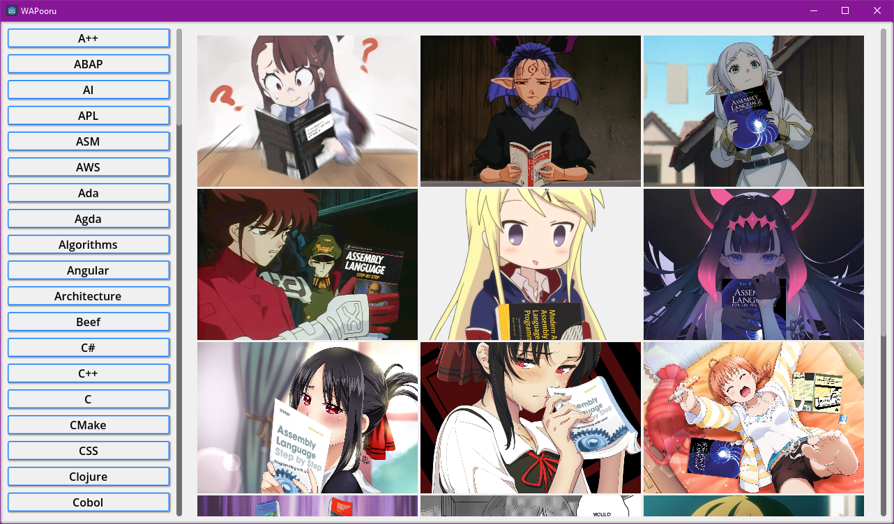

# WAPooru - Waifus and Programming Books

> [!NOTE]  
> This is still in very early stage. Expect breaking stuff.  

Fetches images of anime girls with programming books from https://github.com/cat-milk/Anime-Girls-Holding-Programming-Books thru Github REST API.

## Process

> [!WARNING]  
> Primary rate limit for unauthenticated requests is 60 requests per hour.  
> If you need to debug continuously, make sure to have a save file first or simply have authenticated requests by including your Github tokens on headers.  
> https://docs.github.com/en/rest/using-the-rest-api/rate-limits-for-the-rest-api

It basically requests the blob files through the entire repo, so we get `PackedByteArray` buffers which are then converted into readable `ImageTextures`.

This means that it doesn't really download the images to any folder.

## License
Uses MIT license. See [LICENSE.md](LICENSE.md)